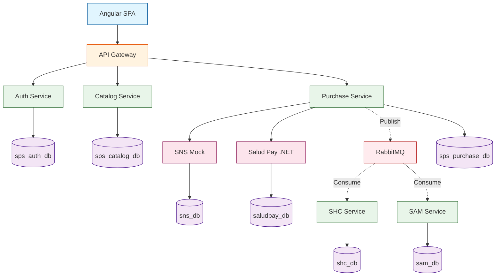

# Diagrama de Componentes

```mermaid
graph TD
    UI[Angular SPA] --> AG[API Gateway]
    AG --> Auth[Auth Service]
    AG --> Cat[Catalog Service]
    AG --> Pur[Purchase Service]
    Pur --> SNS[SNS Mock]
    Pur --> SP[Salud Pay .NET]
    Pur -.->|Publish| RMQ[RabbitMQ]
    RMQ -.->|Consume| SHC[SHC Service]
    RMQ -.->|Consume| SAM[SAM Service]
    
    Auth --> DB_Auth[(sps_auth_db)]
    Cat --> DB_Cat[(sps_catalog_db)]
    Pur --> DB_Pur[(sps_purchase_db)]
    SP --> DB_SP[(saludpay_db)]
    SNS --> DB_SNS[(sns_db)]
    SHC --> DB_SHC[(shc_db)]
    SAM --> DB_SAM[(sam_db)]
    
    classDef frontend fill:#e1f5fe,stroke:#01579b;
    classDef gateway fill:#fff3e0,stroke:#e65100;
    classDef core fill:#e8f5e9,stroke:#1b5e20;
    classDef external fill:#fce4ec,stroke:#880e4f;
    classDef db fill:#f3e5f5,stroke:#4a148c;
    classDef queue fill:#ffebee,stroke:#b71c1c;

    class UI frontend;
    class AG gateway;
    class Auth,Cat,Pur,SHC,SAM core;
    class SNS,SP external;
    class DB_Auth,DB_Cat,DB_Pur,DB_SP,DB_SNS,DB_SHC,DB_SAM db;
    class RMQ queue;
```
