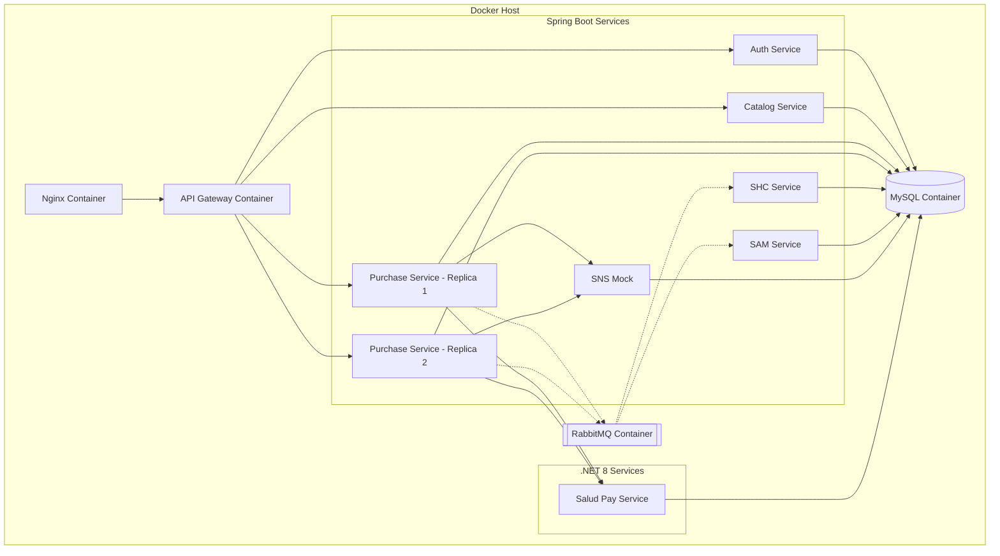

# Diagrama de Despliegue

```mermaid
graph TD
    subgraph "Docker Host"
        Nginx[Nginx Container]
        Gateway[API Gateway Container]
        MySQL[(MySQL Container)]
        RMQ[[RabbitMQ Container]]
        
        subgraph "Spring Boot Services"
            Auth[Auth Service]
            Catalog[Catalog Service]
            Purchase1[Purchase Service - Replica 1]
            Purchase2[Purchase Service - Replica 2]
            SHC[SHC Service]
            SAM[SAM Service]
            SNS[SNS Mock]
        end
        
        subgraph ".NET 8 Services"
            SaludPay[Salud Pay Service]
        end
        
        Nginx --> Gateway
        Gateway --> Auth
        Gateway --> Catalog
        Gateway --> Purchase1
        Gateway --> Purchase2
        
        Purchase1 -.-> RMQ
        Purchase2 -.-> RMQ
        Purchase1 --> SNS
        Purchase2 --> SNS
        Purchase1 --> SaludPay
        Purchase2 --> SaludPay
        
        RMQ -.-> SHC
        RMQ -.-> SAM
        
        Auth --> MySQL
        Catalog --> MySQL
        Purchase1 --> MySQL
        Purchase2 --> MySQL
        SHC --> MySQL
        SAM --> MySQL
        SNS --> MySQL
        SaludPay --> MySQL
    end
```
