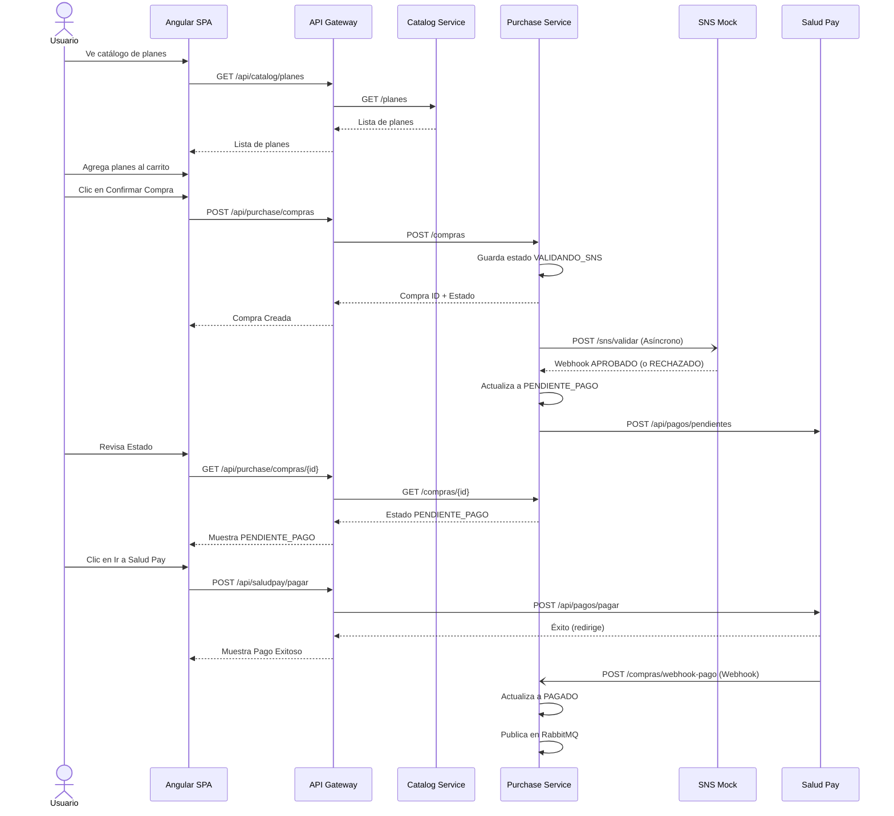

# Flujo de Compra

```mermaid
sequenceDiagram
    actor Usuario
    participant UI as Angular SPA
    participant GW as API Gateway
    participant Cat as Catalog Service
    participant Pur as Purchase Service
    participant SNS as SNS Mock
    participant SP as Salud Pay

    Usuario->>UI: Ve catálogo de planes
    UI->>GW: GET /api/catalog/planes
    GW->>Cat: GET /planes
    Cat-->>GW: Lista de planes
    GW-->>UI: Lista de planes
    
    Usuario->>UI: Agrega planes al carrito
    Usuario->>UI: Clic en Confirmar Compra
    UI->>GW: POST /api/purchase/compras
    GW->>Pur: POST /compras
    
    Pur->>Pur: Guarda estado VALIDANDO_SNS
    Pur-->>GW: Compra ID + Estado
    GW-->>UI: Compra Creada
    
    Pur-)SNS: POST /sns/validar (Asíncrono)
    SNS-->>Pur: Webhook APROBADO (o RECHAZADO)
    Pur->>Pur: Actualiza a PENDIENTE_PAGO
    Pur->>SP: POST /api/pagos/pendientes
    
    Usuario->>UI: Revisa Estado
    UI->>GW: GET /api/purchase/compras/{id}
    GW->>Pur: GET /compras/{id}
    Pur-->>GW: Estado PENDIENTE_PAGO
    GW-->>UI: Muestra PENDIENTE_PAGO
    
    Usuario->>UI: Clic en Ir a Salud Pay
    UI->>GW: POST /api/saludpay/pagar
    GW->>SP: POST /api/pagos/pagar
    SP-->>GW: Éxito (redirige)
    GW-->>UI: Muestra Pago Exitoso
    
    SP-)Pur: POST /compras/webhook-pago (Webhook)
    Pur->>Pur: Actualiza a PAGADO
    Pur->>Pur: Publica en RabbitMQ
```
