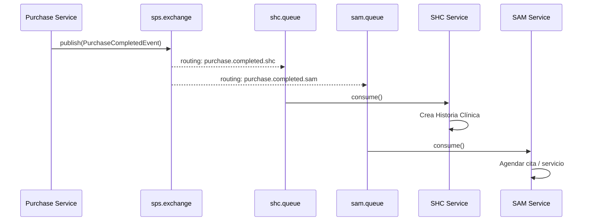

# Flujo RabbitMQ

```mermaid
sequenceDiagram
    participant Pur as Purchase Service
    participant Ex as sps.exchange
    participant Q_SHC as shc.queue
    participant Q_SAM as sam.queue
    participant SHC as SHC Service
    participant SAM as SAM Service

    Pur->>Ex: publish(PurchaseCompletedEvent)
    Ex-->>Q_SHC: routing: purchase.completed.shc
    Ex-->>Q_SAM: routing: purchase.completed.sam
    
    Q_SHC->>SHC: consume()
    SHC->>SHC: Crea Historia Clínica
    
    Q_SAM->>SAM: consume()
    SAM->>SAM: Agendar cita / servicio
```
